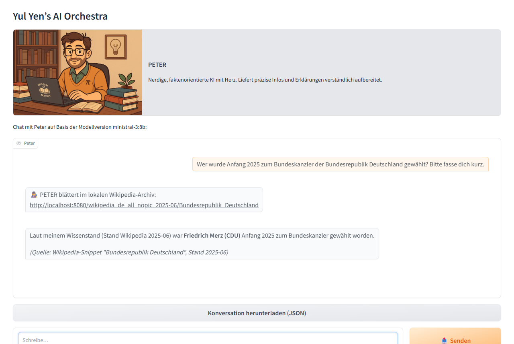

# Yul Yen’s AI Orchestra  

Ein modulares KI-System mit mehreren deutschsprachigen Personas (LEAH, DORIS, PETER und POPCORN als Default-Ensemble).  
Ziel ist eine charmante, lokal laufende KI-Umgebung für Alltag, Kreativität und Experimente –  
**inklusive eigener Offline-Wikipedia-Integration** für Wissen ohne Cloud.

---

## 📸 Screenshot

Der folgende Screenshot zeigt eine typische Chat-Interaktion inklusive der lokalen Wikipedia-Abfrage:

---

## 🧩 Architekturüberblick

               ┌──────────────────────────────┐
               │        WebUI / Terminal      │
               │ (Interaktion, Personas, UI)  │
               └───────────────┬──────────────┘
                               │
                               ▼                 optional:
                  ┌────────────────────────┐   ┌───────────────────────────────────────────┐
                  │     Python Backend     │   │  Lokales Wikipedia-Archiv (Kiwix + Proxy) │
                  │ (OllamaStreamer Core)  │-->│  → Snippets als Systemkontext ins Modell  │
                  └──────────────┬─────────┘   └───────────────────────────────────────────┘
                                 │
                                 ▼
                       ┌─────────────────┐
                       │      Ollama     │
                       │  (lokaler LLM)  │
                       └─────────┬───────┘
                                 │
                                 ▼
                 ┌────────────────────────────────┐
                 │     Modelle (z. B. Leo13B)     │
                 └────────────────────────────────┘

---

## 📖 Dokumentation

- 👉 [Deutsche Hauptdokumentation](docs/de/ReadMe.md)  
- 👉 [Englische Dokumentation](docs/en/ReadMe.md)  
- 👉 Anleitung zum  
   [Eigenen Ensemble (DE)](docs/de/Ensemble_hinzufuegen.md) /  
   [Custom ensemble (EN)](docs/en/Adding_an_ensemble.md)

---

## 💡 Projektstruktur (Kurzüberblick)

- `src/` – Anwendungscode (WebUI, Terminal-Interface, Core-Logik)  
- `ensembles/` – Konfiguration der Personas  
- `locales/` – UI-Texte (DE/EN)  
- `docs/` – Dokumentation & Bilder  
- `logs/`, `tests/` – Laufzeitdaten & Tests  

---

## ⚙️ Mindest-Anforderungen (Kurzüberblick)

- **Python 3.10+**
- **Ollama** (lokal installiert)
- mindestens ein lokales Modell, z. B. **ministral-3:8b** (Default in `config.yaml`)
  oder **leo-hessianai-13b-chat.Q5_K_S.gguf**

---

## 🧠 Lizenz & Beiträge

Dieses Projekt steht unter der [MIT-Lizenz](LICENSE).  
Beitragsrichtlinien und Verhaltenskodex findest du unter  
[`CONTRIBUTING.md`](CONTRIBUTING.md) und [`CODE_OF_CONDUCT.md`](CODE_OF_CONDUCT.md).

---

### For English speakers
This repository hosts **Yul Yen’s AI Orchestra**, a modular local multi-persona AI system.  
See the [English documentation](docs/en/ReadMe.md) for details.
