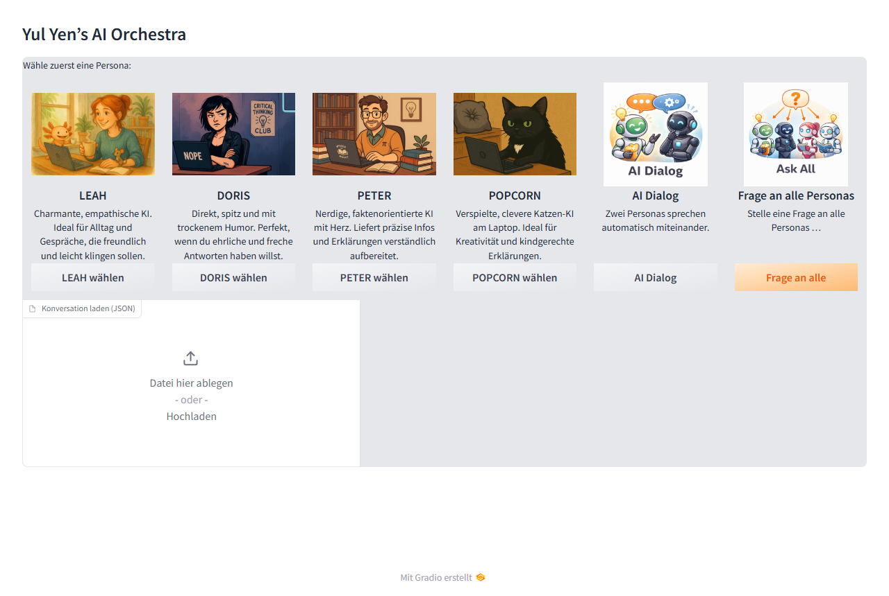

# Yul Yen's AI Orchestra


Ein modulares Multi-Persona-KI-System, das **komplett lokal** läuft — kein Cloud-Zwang, keine Daten verlassen den Rechner.
Vier deutschsprachige Personas (LEAH, DORIS, PETER und POPCORN) mit eigenen Charakteren, **Offline-Wikipedia-Integration** via Kiwix und drei Zugangswegen: Web-UI, Terminal und HTTP-API.



---

## ✨ Highlights

- **4 Personas, 1 lokales LLM** (via [Ollama](https://ollama.com/)) — Charaktere per System-Prompt, Temperatur & Co. pro Persona konfiguriert
- **Offline-Wikipedia**: spaCy extrahiert Schlagwörter, ein lokaler Kiwix-Proxy liefert Artikel-Snippets als Faktenkontext — so kennt das Modell auch Ereignisse **nach seinem Trainings-Cutoff**:

  

- **Ask-All**: eine Frage an alle Personas, Antworten erscheinen live gestreamt
- **AI-Dialog (Self-Talk)**: zwei Personas unterhalten sich automatisch
- **Text-to-Speech** mit Piper (persona-eigene Stimmen)
- **E-Mail-Adapter** (opt-in): Personas per IMAP/SMTP anschreiben
- **Security-Guard**: Prompt-Injection-Schutz, PII-Filter, Wrongdoing-Guardrail mit Session-Lock
- **Setup-Doktor**: `python src/launch.py --doctor` prüft Ollama, Modell, spaCy, Kiwix und VRAM mit konkreten Fix-Hinweisen

---

## 🧩 Architekturüberblick

               ┌──────────────────────────────┐
               │   WebUI / Terminal / API     │
               │ (Interaktion, Personas, UI)  │
               └───────────────┬──────────────┘
                               │
                               ▼                 optional:
                  ┌────────────────────────┐   ┌───────────────────────────────────────────┐
                  │     Python Backend     │   │  Lokales Wikipedia-Archiv (Kiwix + Proxy) │
                  │ (Streaming, Security)  │-->│  → Snippets als Systemkontext ins Modell  │
                  └──────────────┬─────────┘   └───────────────────────────────────────────┘
                                 │
                                 ▼
                       ┌─────────────────┐
                       │      Ollama     │
                       │  (lokaler LLM)  │
                       └─────────┬───────┘
                                 │
                                 ▼
                 ┌────────────────────────────────┐
                 │ Modelle (z. B. ministral-3:8b) │
                 └────────────────────────────────┘

---

## 🚀 Schnellstart

```bash
git clone https://github.com/YulYen/YulYens_AI.git
cd YulYens_AI
python -m venv .venv && .venv\Scripts\activate   # Windows (Linux/macOS: source .venv/bin/activate)
pip install -r requirements.txt
python -m spacy download de_core_news_lg
ollama pull ministral-3:8b

python src/launch.py --doctor        # Preflight-Check: läuft alles?
python src/launch.py -e classic     # Start (Web-UI auf http://127.0.0.1:7860)
```

---

## 📖 Dokumentation

- 👉 [Deutsche Hauptdokumentation](docs/de/ReadMe.md)
- 👉 [Englische Dokumentation](docs/en/ReadMe.md)
- 👉 [Funktionsübersicht (DE)](docs/de/Features.md) / [Features (EN)](docs/en/Features.md)
- 👉 Anleitung zum
   [Eigenen Ensemble (DE)](docs/de/Ensemble_hinzufuegen.md) /
   [Custom ensemble (EN)](docs/en/Adding_an_ensemble.md)
- 👉 [Feature-Backlog](backlog.md)

---

## 💡 Projektstruktur (Kurzüberblick)

- `src/` – Anwendungscode (Web-UI, Terminal-UI, API, Core-Logik, E-Mail-Adapter, TTS, Security)
- `ensembles/` – Konfiguration der Personas (Prompts, LLM-Optionen, Avatare)
- `locales/` – UI-Texte (DE/EN)
- `docs/` – Dokumentation & Screenshots
- `logs/`, `tests/` – Laufzeitdaten & Pytest-Suite

---

## ⚙️ Mindest-Anforderungen

- **Python 3.10+**
- **Ollama** (lokal installiert)
- mindestens ein lokales Modell, z. B. **ministral-3:8b** (Default in `config.yaml`;
  zur Modellwahl siehe [Modellwechsel-Analyse](docs/modellwechsel_juni_2026.md))

---

## 🧠 Lizenz & Beiträge

Dieses Projekt steht unter der [MIT-Lizenz](LICENSE).
Beitragsrichtlinien und Verhaltenskodex findest du unter
[`CONTRIBUTING.md`](CONTRIBUTING.md) und [`CODE_OF_CONDUCT.md`](CODE_OF_CONDUCT.md).

---

### For English speakers
This repository hosts **Yul Yen's AI Orchestra**, a modular local multi-persona AI system.
See the [English documentation](docs/en/ReadMe.md) for details.
