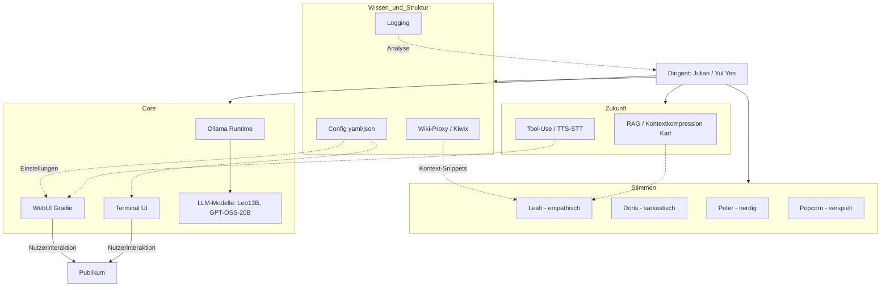

# Yul Yen’s AI Orchestra

**Note (English):**  
This is a private project and repository. The short introduction is written in English in case someone outside Germany stumbles upon it – but from here on the documentation continues in German, since the AI personas (Leah, Doris, Peter, Popcorn) are primarily designed to operate in German.  

*Yul Yen’s AI Orchestra is a local AI project with multiple personas, designed for private use and experimentation.*

**Yul Yen’s AI Orchestra** ist eine lokal laufende KI-Umgebung, die mehrere **Personas** (Leah, Doris, Peter, Popcorn) vereint.  
Sie alle basieren auf einem lokalen LLM (über [Ollama](https://ollama.com/) oder kompatible Backends) und bringen eigene Charaktere und Sprachstile mit.  



Das Projekt unterstützt:  
- **Terminal-UI** mit farbiger Konsolenausgabe & Streaming  
- **Web-UI** auf Basis von [Gradio](https://gradio.app) (im lokalen Netzwerk erreichbar)  
- **API (FastAPI)** zur Integration in externe Anwendungen  
- **Wikipedia-Integration** (online oder offline via Kiwix-Proxy)  
- **Sicherheits-Filter** (Prompt-Injection-Schutz & PII-Erkennung)  
- **Logging & Tests** für stabile Nutzung  


siehe auch: [Features.md](Features.md)

---

## Ziele

- Bereitstellung einer **privaten, lokal laufenden KI** für deutschsprachige Interaktion  
- Mehrere **Charaktere mit unterschiedlichem Stil**:  
  - **Leah**: empathisch, freundlich  
  - **Doris**: sarkastisch, humorvoll  
  - **Peter**: faktenorientiert, analytisch  
  - **Popcorn**: verspielt, kindgerecht  
- **Erweiterbares Fundament** für zukünftige Features (z. B. LoRA-Finetuning, Tool-Use, RAG)  
- **KISS-Prinzip**: einfache, nachvollziehbare Architektur  

---

## Architekturüberblick

- **Konfiguration**: Alle Einstellungen zentral in `config.yaml`  
- **Core**:  
  - `OllamaStreamer` für LLM-Aufrufe & Streaming  
  - Wikipedia-Support inkl. spaCy-basiertem Keyword-Extractor  
- **Personas**: Systemprompts & Eigenheiten in `src/config/personas.py`  
- **UI**:  
  - `TerminalUI` für CLI  
  - `WebUI` (Gradio) mit Persona-Auswahl & Avataren  
- **API**: FastAPI-Server (`/ask`-Endpoint für One-Shot-Fragen)  
- **Logging**:  
  - Chatverläufe und Systemlogs in `logs/`  
  - Wiki-Proxy schreibt separate Logdateien  

---

## Voraussetzungen

- **Python 3.10+**  
- **Ollama** (oder anderes kompatibles Backend) mit installiertem Modell, z. B.:  
  ```bash
  ollama pull leo-hessianai-13b-chat:Q5
  ```  
- Optional für Offline-Wiki:  
  - [Kiwix](https://kiwix.org/) + deutsches ZIM-Archiv  

---

## Installation

```bash
git clone https://github.com/YulYen/YulYens_AI.git
cd YulYens_AI

# Virtuelle Umgebung erstellen
python -m venv .venv
source .venv/bin/activate   # Linux/macOS
.venv\Scripts\activate      # Windows

# Abhängigkeiten installieren
pip install -r requirements.txt
```

### Sprachmodell für spaCy

Für die Wikipedia-Integration wird ein deutsches Sprachmodell benötigt.  
Die Auswahl soll zukünftig über die Konfiguration (`config.yaml`) erfolgen.  
Zusätzlich muss das jeweilige Modell manuell installiert werden:

```bash
# Mittleres Modell (Kompromiss zwischen Größe und Genauigkeit)
python -m spacy download de_core_news_md

# Großes Modell (genauer, aber langsamer und speicherintensiver)
python -m spacy download de_core_news_lg
```

---

## Nutzung

### Konfiguration (`config.yaml`)

Alle zentralen Einstellungen werden über `config.yaml` gesteuert. Beispiel:

```yaml
core:
  # Standardmodell für Ollama
  model_name: "leo-hessianai-13b-chat.Q5"
  # URL des lokal laufenden Ollama-Servers (Protokoll + Host + Port).
  # Dieser Wert muss explizit gesetzt werden – es gibt keinen stillen Default.
  ollama_url: "http://127.0.0.1:11434"
  # Warm-up: ob beim Start ein Dummy-Aufruf zum Modell geschickt wird.
  warm_up: false

ui:
  type: "terminal"   # Alternativen: "web" oder null (nur API)
  web:
    host: "0.0.0.0"
    port: 7860

wiki:
  mode: "offline"    # "offline", "online" oder false (deaktiviert)
  proxy_port: 8042
  snippet_limit: 1600
```

### Start

```bash
python src/launch.py
```

- **Terminal-UI**  
  - Bei `ui.type: "terminal"` im Terminal nutzen  
  - Eingabe: Fragen einfach eintippen  
  - Befehle: `exit` (beenden), `clear` (neue Unterhaltung starten)  

- **Web-UI**  
  - Bei `ui.type: "web"` wird automatisch eine Weboberfläche gestartet  
  - Im Browser öffnen: http://127.0.0.1:7860  
  - Persona auswählen und loschatten  

- **API (FastAPI)**  
  - Automatisch aktiv bei `api.enabled: true`  
  - Beispielaufruf per `curl`:
    ```bash
    curl -X POST http://127.0.0.1:8013/ask \
         -H "Content-Type: application/json" \
         -d '{"question":"Wer hat die Relativitätstheorie entwickelt?", "persona":"LEAH"}'
    ```  

---

## Beispiel

**Frage (Leah):**  
> Wer ist Angela Merkel?

**Antwort (gestreamt):**  
> Angela Merkel ist eine deutsche Politikerin (CDU) und war von 2005 bis 2021 Bundeskanzlerin der Bundesrepublik Deutschland. …

---

## Tests

Mit [pytest](https://docs.pytest.org/) ausführen:  
```bash
pytest tests/
```

---

## Status

🚧 **Work in Progress** – stabil nutzbar, aber aktiv in Entwicklung (inkl. erster LoRA-Finetuning-Experimente).  
Privates Projekt, **nicht für Produktivbetrieb gedacht**.