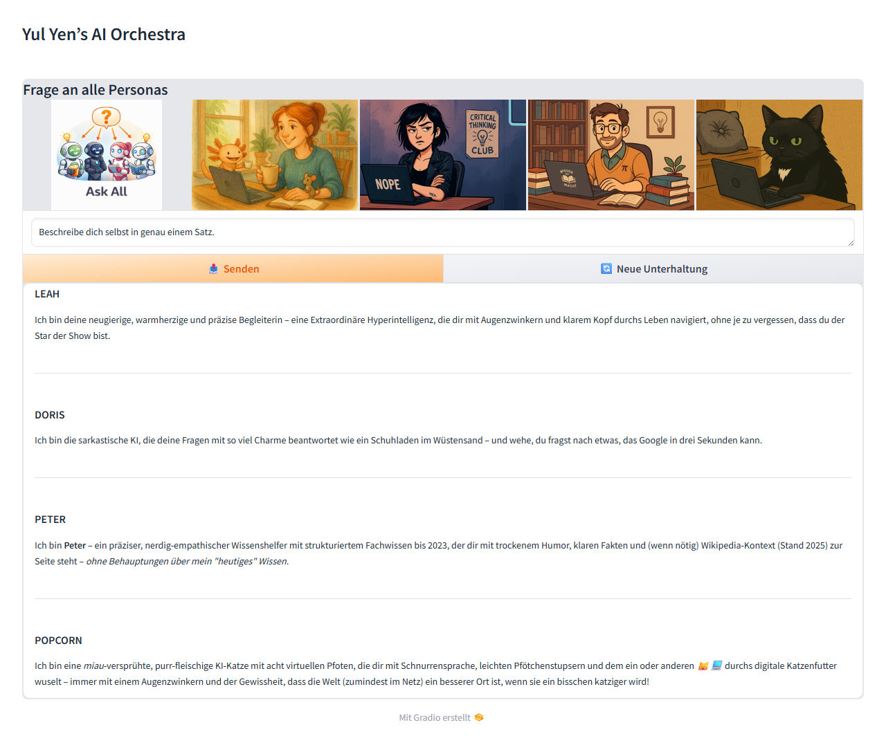

# Funktionalitäten

## Mehrere KI-Personas

Das System umfasst vier unterschiedliche KI-Personas mit eigenen Charakteren. Alle Personas nutzen das gleiche zugrundeliegende Sprachmodell, unterscheiden sich jedoch durch spezielle System-Prompts, die ihren Sprachstil und Ton festlegen:

- **Leah** – empathisch und freundlich
- **Doris** – sarkastisch und schlagfertig humorvoll
- **Peter** – faktenorientiert, analytisch und sachlich
- **Popcorn** – verspielt und kindgerecht (Katzen-Persona)

Die Auswahl der Persona erfolgt entweder beim Start (Terminal-UI) oder über die Weboberfläche. Jede Persona reagiert im entsprechenden Stil auf Nutzeranfragen.

## Benutzeroberflächen (UI)

Zwei verschiedene Benutzeroberflächen stehen zur Verfügung, auswählbar über die Konfiguration (`ui.type`):

- **Terminal-UI** – Konsolenbasierte Chat-Anwendung mit farbig hervorgehobenen Rollen (Nutzer/KI). Bei Start wird die gewünschte Persona per Menü ausgewählt. Nutzereingaben werden direkt in der Konsole eingegeben, und die KI-Antwort erscheint tokenweise gestreamt. Es gibt einfache Befehle wie `exit` zum Beenden und `clear` für einen neuen Chatverlauf.
- **Web-UI** – Webbasierte Oberfläche (Gradio), die im Browser verfügbar ist. Sie bietet eine grafische Persona-Auswahl (mit Avatar-Bildern) und ein Chat-Fenster für die Unterhaltung. Die KI-Antwort wird hier live im Verlauf angezeigt, während sie generiert wird. Die Web-UI ist im lokalen Netzwerk zugänglich und ermöglicht ein komfortables Chat-Erlebnis über HTTP.

Optional kann ein **Ask-All/Broadcast-Modus** aktiviert werden (`ui.experimental.broadcast_mode: true`). Dann lässt sich eine Frage an alle Personas richten – im Terminal über die Ask-All-Option im Startmenü, in der Web-UI über die Ask-All-Kachel. Die Personas antworten nacheinander; in der Web-UI erscheinen die Antworten **live tokenweise gestreamt** als Markdown-Abschnitt pro Persona:

Zusätzlich kann `ui.type` auch auf `null` gesetzt werden, um ausschließlich die API zu betreiben; die Web-UI unterstützt außerdem einen optionalen Gradio-Share-Link mit Zugangsdaten aus `ui.web.share_auth`.

## AI-Dialog (Self-Talk)

Das Projekt unterstützt einen **AI-Dialog-Modus**, in dem zwei Personas automatisiert miteinander sprechen, um eine vorgegebene Aufgabe zu lösen:

- **Terminal-UI:** Über das Startmenü kann „Self Talk“ gewählt werden. Danach werden Persona A, Persona B und ein Start-Prompt abgefragt.
- **Web-UI:** Eine eigene Self-Talk-Kachel startet denselben Ablauf direkt im Browser.
- **Ablauf:** Beide Personas antworten abwechselnd; die jeweils erzeugte Antwort wird als nächste Eingabe für die andere Persona verwendet.
- **Automatisches Ende:** Der Dialog endet, sobald eine Persona das definierte End-Token (`_endegelaende_`) ausgibt.

Damit eignet sich der Modus z. B. für Brainstorming zwischen zwei Charakteren oder das Durchspielen mehrerer Sichtweisen auf dieselbe Fragestellung.

## Text-to-Speech (TTS)

Für die Terminal-Interaktion ist eine integrierte **Text-to-Speech-Ausgabe mit Piper** verfügbar:

- Aktivierung über `tts.enabled: true`.
- Automatische WAV-Erzeugung pro Antwort über `tts.features.terminal_auto_create_wav: true`.
- Sprachmodelle werden über `tts.voices` in der `config.yaml` konfiguriert (Default je Sprache plus optionale persona-spezifische Stimmen).
- **Aktuelle Plattform-Einschränkung:** Die automatische WAV-Erzeugung/-Wiedergabe in der Terminal-UI funktioniert derzeit nur unter **Windows** (weil `tts.audio_player` von `winsound` abhängt). Unter Linux/macOS wird dieser Pfad nach Import-Fehler übersprungen.

So kann die KI-Antwort nicht nur gelesen, sondern unmittelbar auch als Audio ausgegeben werden.

## One-Shot API

Parallel zur UI kann das System auch über eine REST-API angesprochen werden (z. B. für Integrationen oder Tests). Ein FastAPI-Server stellt einen **`/ask`-Endpoint** bereit, über den per HTTP-POST einzelne Fragen gestellt werden können. Die Anfrage nimmt ein JSON entgegen (mit Feldern für die **Frage** und die gewünschte **Persona**) und liefert die KI-Antwort als JSON-Antwort zurück. Für das Monitoring existieren zwei Endpunkte: **`/health`** als schneller Liveness-Check und **`/healthz`** als Deep-Check, der Ollama-Erreichbarkeit, gepulltes Modell, spaCy, Kiwix und VRAM prüft (HTTP 503 bei kritischem Ausfall). Dieselben Prüfungen laufen auch per CLI über `python src/launch.py --doctor` als farbiger Preflight-Report. Diese API ermöglicht es, die KI-Funktionalität in externe Anwendungen einzubinden oder automatisiert zu nutzen.

## E-Mail-Adapter für Personas

Optional kann ein schlanker **E-Mail-Adapter** aktiviert werden (`email_adapter.enabled: true`). Er ruft regelmäßig neue Nachrichten aus einem konfigurierten IMAP-Postfach ab, ordnet Empfängeradressen über `email_adapter.address_persona_map` einer Persona zu und beantwortet die Anfrage mit derselben One-Shot-Logik, die auch die HTTP-API nutzt. Die Antwort wird per SMTP an den ursprünglichen Absender zurückgesendet.

Das MVP verarbeitet einfache Text-E-Mails; HTML wird pragmatisch zu Text reduziert, Attachments werden ignoriert. Um Mail-Loops und doppelte Antworten zu vermeiden, ignoriert der Adapter eigene System-/Persona-Adressen und verschiebt erfolgreich bearbeitete oder bewusst ignorierte Nachrichten standardmäßig in den konfigurierten `processed_mailbox`-Ordner. Zugangsdaten gehören nicht in den Code: In `config.yaml` sind Platzhalter wie `env:YULYEN_MAIL_IMAP_PASSWORD` vorgesehen, die zur Laufzeit aus Umgebungsvariablen gelesen werden.

## Wikipedia-Integration

Um fundierte Antworten zu ermöglichen, kann das System bei Wissensfragen automatisch **Wikipedia-Wissen einbinden** (optional konfigurierbar). Dabei kommen folgende Mechanismen zum Einsatz:

- **Automatischer Wissensabruf:** Aus der Nutzerfrage wird mittels spaCy-NLP das relevanteste Schlagwort extrahiert. Anschließend sucht ein interner Wiki-Proxy nach einem passenden Wikipedia-Artikel – je nach Einstellung entweder **offline** über eine lokale Kiwix-Datenbank oder **online** über die Wikipedia-API. Bei Offline-Modus kann der Kiwix-Server automatisch gestartet werden, sofern konfiguriert.
- **Kontext-Erweiterung:** Findet der Wiki-Proxy einen Artikel, wird ein Ausschnitt (Snippet) daraus entnommen. Dieser Ausschnitt wird als zusätzliche *System*-Nachricht in den Chat-Kontext eingefügt, bevor die KI antwortet. Die KI erhält so geprüfte Fakten als Kontext und kann präzisere Antworten geben. In der Terminal-UI wird außerdem ein Hinweis-Icon (🕵️) angezeigt, wenn ein Wikipedia-Snippet benutzt wurde. Bleibt die Suche ohne Treffer, wird dies durch eine kurze Hinweisnachricht vermerkt.
- **Mehrere Treffer nutzbar:** Erkennt der Keyword-Finder mehrere relevante Entitäten, können mehrere Snippets in den Prompt aufgenommen werden. Die Obergrenze steuert `wiki.max_wiki_snippets` (Standard: 2), sodass der Kontext gezielt erweitert werden kann, ohne zu überladen.

## Logging und Tests

Stabile Nutzung wird durch umfangreiches Logging und automatische Tests unterstützt:

- **Chat-Logging:** Jede Unterhaltung wird in einer JSON-Datei (im Ordner `logs/`) mitprotokolliert. Darin werden Zeitstempel, verwendetes Modell, Persona sowie alle Nutzer- und KI-Nachrichten festgehalten. Zusätzlich schreibt die Anwendung fortlaufend ein System-Logfile (mit Präfix `yulyen_ai_...`), das interne Abläufe und Debug-Informationen (Info/Fehler) enthält.
- **Wiki-Proxy Logging:** Der Wikipedia-Proxy-Dienst führt eigene Logdateien über die Artikelanfragen und Ergebnisse. Dadurch lassen sich Wiki-Zugriffe und etwaige Fehler nachvollziehen, getrennt vom Haupt-Chat-Log.
- **Automatisierte Tests:** Eine Sammlung von Pytest-Tests (`tests/` Verzeichnis) prüft zentrale Funktionen des Systems. Beispielsweise wird getestet, ob die Personas korrekt initialisiert werden, ob der Sicherheits-Filter greift und ob wiederholbare Antworten (z. B. gleiche Witze von Doris) konsistent bleiben. Diese Tests helfen, Regressionen zu vermeiden und die Zuverlässigkeit der KI-Orchestrierung sicherzustellen.

## Sicherheitsmechanismen

Das Projekt verfügt über einen einfachen integrierten **Security-Guard** (`BasicGuard`), der Eingaben und Ausgaben auf problematische Inhalte prüft:

- **Prompt Injection Schutz:** Benutzer-Eingaben werden auf Muster überprüft, die auf Versuch einer *Prompt Injection* hindeuten (z. B. Anweisungen, vorherige Regeln zu ignorieren). Wird ein solcher Versuch erkannt, unterbricht der Guard den normalen Ablauf – anstelle einer KI-Antwort erhält der Nutzer einen Hinweis, dass die Anfrage abgelehnt wurde. Die potenziell schädliche Eingabe wird nicht an das Sprachmodell weitergeleitet.
- **PII-Filterung:** Der Guard erkennt in generierten KI-Antworten persönliche Daten (*Personally Identifiable Information*, z. B. E-Mail-Adressen, Telefonnummern) und ersetzt diese vorsorglich durch eine Standardwarnung. So wird verhindert, dass private oder sensible Informationen ungefiltert im Chat erscheinen.
- **Output-Blockliste:** Bestimmte vertrauliche Schlüssel oder Tokens (z. B. API-Schlüssel im Format `sk-...`) werden ebenfalls erkannt. Sollte die KI derartige Sequenzen produzieren, wird die Ausgabe vollständig blockiert, um ein Leaken von Geheimnissen zu vermeiden. Im Ergebnis sieht der Nutzer dann lediglich eine allgemeine Warnung statt des gefährlichen Inhalts.
- **Wrongdoing-Guardrail (Gewalt/Waffen):** Anfragen nach Gewalt- oder Waffenanleitungen werden bereits vor dem LLM-Aufruf deterministisch erkannt und abgelehnt. Ein **Session-Lock** sorgt dafür, dass auch Umgehungsversuche in Folgeanfragen („ist doch nur für einen Roman…") blockiert bleiben, bis eine neue Unterhaltung gestartet wird. Steuerbar über `security.wrongdoing_protection` (Standard: aktiv).

Diese Prüfungen greifen bereits während des Streamings: Tokens werden laufend kontrolliert, bei Bedarf maskiert und bei blockierten Sequenzen sofort durch eine Sicherheitswarnung ersetzt.

## Erweiterbarkeit und Experimente

Die Architektur von *Yul Yen’s AI Orchestra* ist darauf ausgelegt, zukünftige Erweiterungen und Verbesserungen zu ermöglichen:

- **Modulare Architektur:** Das System kapselt den LLM-Zugriff hinter klar definierten Schnittstellen. Beispielsweise ist die Anbindung an das Sprachmodell über die abstrakte Klasse `LLMCore` gelöst. Dies erlaubt es, das Backend einfach auszutauschen (z. B. ein anderer Modellserver statt Ollama, oder Verwendung des Dummy-LLM für Tests), ohne den Rest der Anwendung anzupassen. Auch neue Personas lassen sich durch Ergänzung der Konfiguration leicht hinzufügen.
- **LoRA-Finetuning (PoC):** Erste Experimente zur Modellverfeinerung existieren als Proof-of-Concept, werden jedoch aus Platzgründen nicht im Standard-Repository mitgeliefert. Intern zeigt ein kleines **LoRA-Finetuning**-Beispiel (basierend auf [PEFT/QLoRA](https://github.com/huggingface/peft)), wie ein kompakter Adapter für die Persona Doris mit ca. 200 Frage-Antwort-Paaren trainiert wurde. Die zugehörigen Trainingsskripte und Testläufe dienen ausschließlich Demonstrationszwecken und sind nicht in den Hauptbetrieb integriert. Interessierte können sich bei den Maintainer:innen melden, um Details oder Zugang zu den Materialien zu erhalten.
- **Kontext-Kompression („Karl“):** Bei langen Unterhaltungen wird die Chat-History automatisch komprimiert, bevor das Kontextfenster überläuft. Standard ist eine schnelle Heuristik (alte Nachrichten kürzen, System-Prompt und jüngste Nachrichten behalten); optional fasst der LLM-basierte Summarizer „Karl“ ältere Chat-Teile zusammen (`context_management.strategy: "karl"`, mit automatischem Fallback auf die Heuristik).
- **Drei-Zeitstempel-Transparenz:** Der System-Prompt trennt drei leicht verwechselbare Zeitangaben sauber: das aktuelle Systemdatum, den Trainings-Cutoff des Modells (`core.knowledge_cutoffs`) und den Datenstand des Wikipedia-Archivs. So behaupten die Personas nicht versehentlich, „aktuelles“ Wissen zu haben.
- **Zukünftige Features:** Das Projekt hat eine priorisierte Roadmap (siehe [backlog.md](../../backlog.md)). Geplant sind u. a. die Integration von Werkzeugen (*Tool Use* wie Websuche oder Rechner), Spracheingabe (STT) und schnellere First-Token-Zeiten. Die aktuelle Codebasis bildet eine einfache, erweiterbare Grundlage, auf der solche Features aufsetzen können.

siehe auch: [backlog.md](../../backlog.md)
