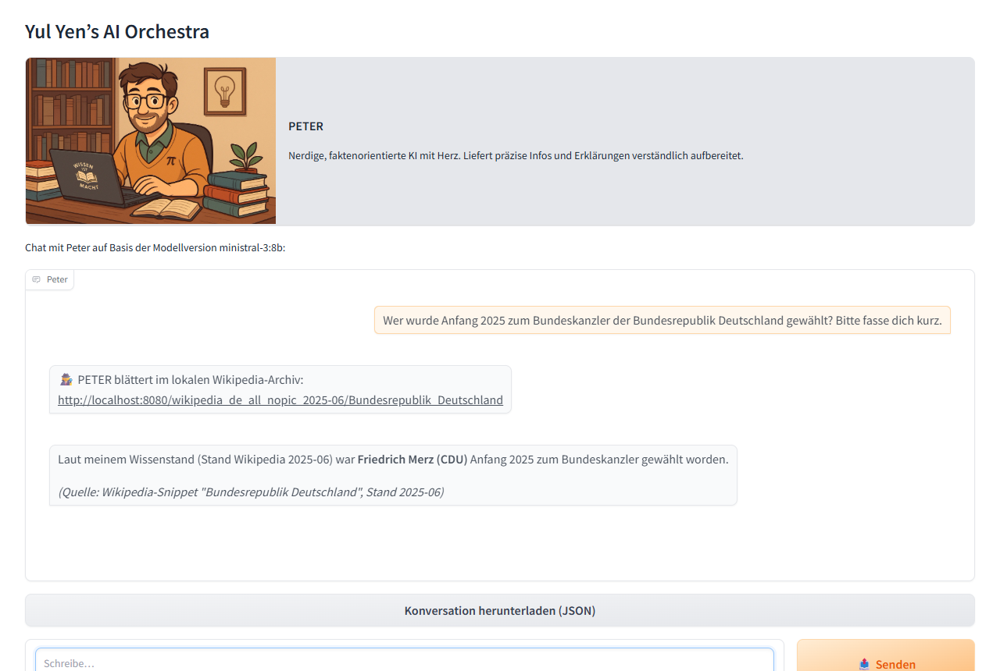

# Yul Yen's AI Orchestra

> _Translation note (2026-07-04): This document is an English translation of [`docs/de/ReadMe.md`](../de/ReadMe.md). The German file is the authoritative source._

**Yul Yen's AI Orchestra** is a locally running AI environment that combines multiple **personas** (Leah, Doris, Peter, Popcorn).

All personas are based on a local LLM (currently via [Ollama](https://ollama.com/) or compatible backends) and come with their own characters and language styles.

The project supports:
- **Terminal UI** with colored console output & streaming
- **Web UI** built on [Gradio](https://gradio.app) (by default reachable only from your own machine, see `ui.web.host`)
- **Ask-All broadcast**: one question to all personas, replies streamed live and in parallel
- **AI dialog (self-talk)** between two personas (terminal + web)
- **Text-to-speech (TTS)** with Piper: automatic WAV generation in the terminal, a "Read aloud" button in the web UI
- **Speech input (STT)** in the web UI: a microphone next to the input field (opt-in via faster-whisper)
- **API (FastAPI)** for integration into external applications (incl. `/healthz` deep check and OpenAI-compatible `/v1` endpoints)
- **Email adapter** (opt-in): personas answer mails via IMAP/SMTP
- **Wikipedia integration** (online or offline via Kiwix proxy)
- **News as a source (RSS)**: feeds fetched in the background, items added as context when the question calls for it
- **Conversation store** in SQLite with history, continuation, Markdown export and an optional login
- **Security filters** (prompt-injection protection, PII detection, wrongdoing guardrail)
- **Setup doctor** (`--doctor`) for preflight checks with concrete fix hints
- **Logging & tests** for stable usage

See also: [Features.md](Features.md)

---

## Goals

- Provide a **private, locally running AI** for German-language interaction
- Multiple **characters with distinct styles**:
  - **Leah**: empathetic, friendly
  - **Doris**: sarcastic, humorous, cheeky
  - **Peter**: fact-oriented, analytical
  - **Popcorn**: playful, child-friendly
- **Extensible foundation** for future features (e.g., LoRA fine-tuning, tool use, RAG)
- **KISS principle**: simple, transparent architecture

---

## Architecture overview

- **Configuration**: All settings centrally stored in `config.yaml`
- **Core**:
  - Swappable LLM core (`OllamaLLMCore`, `DummyLLMCore` for tests) including `YulYenStreamingProvider`
  - Wikipedia support including a spaCy-based keyword extractor
- **Personas**: system prompts & LLM options as YAML under `ensembles/<name>/`; `src/config/personas.py` loads them
- **UI**:
  - `TerminalUI` for the CLI
  - `WebUI` (Gradio) with persona selection & avatars
  - Optional ask-all broadcast mode (enable `ui.experimental.broadcast_mode`) via the Ask-All option in the terminal start menu and the Ask-All card in the web UI — replies are streamed token by token
- **API**: FastAPI server (`/ask` endpoint for one-shot questions, `/health` as liveness stub, `/healthz` as deep check)
- **Context management**: long chat histories are compressed automatically — heuristically (default) or via LLM summarization ("Karl", `context_management.strategy: "karl"`)
- **Email adapter**: optional IMAP/SMTP service that routes incoming mails to a persona and replies (details in [Features.md](Features.md))
- **Conversation store**: conversations live in SQLite (`storage.path`), not in log files — the web UI's history reads from there
- **Logging**:
  - System logs in `logs/`; the raw JSONL transcript of a turn is a debugging artefact and off by default (`logging.conversation_jsonl`)
  - Wiki proxy writes separate log files

---

## Prerequisites

- **Python 3.10+** — CI checks 3.10 and 3.13
- **Ollama** (or another compatible backend) with an installed model, for example:
  ```bash
  ollama pull ministral-3:8b
  ```
  (The default model is set in `config.yaml` under `core.model_name`; a comparison of
  candidate models can be found in [modellwechsel_juni_2026.md](../modellwechsel_juni_2026.md), German only.)
- For tests without Ollama you can set `core.backend: "dummy"` – the echo backend requires no additional downloads and is suitable for CI or quick prototyping.
- Optional for offline wiki usage:
  - [Kiwix](https://kiwix.org/) + German ZIM archive — install & update guide: [Kiwix_Setup.md](Kiwix_Setup.md)

---

## Installation

```bash
git clone https://github.com/YulYen/YulYens_AI.git
cd YulYens_AI

# Create virtual environment
python -m venv .venv
source .venv/bin/activate   # Linux/macOS
.venv\Scripts\activate      # Windows

# Install dependencies
pip install -r requirements.txt
```

### Language model for spaCy

The Wikipedia integration requires a spaCy model that matches your configured language. The keyword finder now looks up the correct package via the combination of `language` and `wiki.spacy_model_variant`, using the mapping in `wiki.spacy_model_map` inside `config.yaml`. This keeps the model choice entirely in configuration, without hard-coded defaults.

Example:

```yaml
language: "en"
wiki:
  spacy_model_variant: "medium"
  spacy_model_map:
    en:
      medium: "en_core_web_md"
      large:  "en_core_web_lg"
```

Additionally, you have to install the corresponding model manually:

```bash
# Medium model (balance between size and accuracy)
python -m spacy download en_core_web_md

# Large model (more accurate, but slower and uses more memory)
python -m spacy download en_core_web_lg
```

---

## Usage

### Configuration (`config.yaml`)

All central settings are controlled through `config.yaml`. Important toggles:

- `language`: controls UI texts and persona prompts (`"de"` or `"en"`).
- `ui.type`: selects the interface (`"terminal"`, `"web"`, or `null` for API only).
- `ui.web.host`: **defaults to `127.0.0.1`** — the web UI is then reachable only from your own machine. Set it to `"0.0.0.0"` if others on the network should use it; enable `ui.web.auth` in that case, or the start-up warns (rightly) and loudly.
- `ui.web.auth.provider`: the web UI's login — `disabled` (default), `local` (users from `ui.web.auth.users`, passwords as `env:NAME`) or `header` (identity from a reverse proxy in front). It applies **independently** of `ui.web.share`. The former `ui.web.share_auth` only acts as a fallback now and is flagged at start-up.
- `storage.enabled`: the conversation store (SQLite at `storage.path`), the basis for history, continuation and Markdown export. **Without a login the web UI still records nothing** — every visitor would be the same user `local` and would see everyone else's conversations. If you deliberately want that on a single seat, set `storage.shared_without_login: true`; the start-up then warns once, loudly. `storage.history_limit` caps the history list, `storage.file_exchange` toggles the JSON download/upload.
- `tts.enabled`: enables/disables text-to-speech.
- `tts.features.terminal_auto_create_wav`: creates one WAV file per reply in terminal mode and plays it — Windows via `winsound`, Linux/macOS via `paplay`/`aplay`/`ffplay` or `afplay`. Without an available player you still get the file in `out/`.
- `api.openai_compatible`: enables the OpenAI-compatible endpoints (`/v1/models`, `/v1/chat/completions`) that let third-party clients such as Open WebUI talk to the personas. **Once `api.host` is no longer `127.0.0.1`, set an `api_key` here** — preferably as `"env:YULYEN_API_KEY"` rather than a literal. `rate_limit_per_minute` caps requests per client.
- `email_adapter.allowed_senders`: **mandatory once `email_adapter.enabled: true`.** Only listed senders get an answer — either a full address (`max@example.org`) or a whole domain (`@my-domain.example`). Without the list the adapter refuses to start and logs why; the rest of the application keeps running. **When upgrading an existing installation this is the one thing to add** — before, anyone who knew the persona address could drive the personas. Related: `email_adapter.max_body_chars` caps how much mail text is adopted (prompt *and* the quote in the reply).
- `rss.enabled`: **one switch for news** — background fetching, automatic use as a context source and the briefing button. The section used to be called `briefing:`; the old name is still read but warned about at start-up. `rss.show_button` hides only the button, `rss.max_chars_per_item` caps how much of each item reaches the context window.
- `security.stream_holdback_chars`: **the knob to turn when replies feel slow to start.** The output guard holds back this many characters so a password or email address is never half-visible before it is recognised. The price: nothing appears until that many characters exist. Measured in the browser (24 chars/s): `96` → first word after ~4.1 s, `32` (default) → ~1.9 s, `0` → ~0.4 s. The default of 32 targets the common case: local, single user. **Raise it to 96** as soon as the server is reachable by others (`api.host`/`ui.web.host` other than `127.0.0.1`, a Gradio share link, the mail adapter) or real credentials appear in conversations — that also hides the text *around* a secret.

Example:

```yaml
language: "de"
core:
  # Choose backend: "ollama" (default) or "dummy" (echo backend for tests)
  backend: "ollama"
  # Default model for Ollama
  model_name: "ministral-3:8b"
  # URL of the locally running Ollama server (protocol + host + port).
  # This value must be set explicitly – there is no silent default.
  ollama_url: "http://127.0.0.1:11434"
  # Warm-up: preload the model in a background thread at startup so the first
  # question hits a warm model. The app starts fine even if Ollama is down.
  warm_up: true
  # How long Ollama keeps the model in memory after a request (seconds).
  # -1 = keep loaded forever, 0 = unload immediately.
  keep_alive: 600

ui:
  type: "web"        # Alternatives: "terminal" or null (API only)
  web:
    host: "127.0.0.1"  # Default: local only. "0.0.0.0" opens the UI to the network
    port: 7860
    share: false       # Optional: public Gradio share link
    auth:
      provider: "disabled"   # disabled | local | header — applies independently of `share`

wiki:
  mode: "offline"    # "offline", "online" or false (disabled)
  spacy_model_variant: "large"  # Alternatives: "medium" or direct model name
  proxy_port: 8042
  snippet_limit: 1200           # Maximum length of a single snippet in characters
  max_wiki_snippets: 2          # Cap for how many different snippets can be injected per question
```

> 💡 **Local overrides:** An optional `config.local.yaml` (gitignored, next to
> `config.yaml`) is deep-merged over the main configuration. This keeps personal
> values (e.g., real mail credentials for the email adapter) out of the public
> repository. Use `env:NAME` placeholders for passwords on top of that.

#### LLM backends

The key `core.backend` determines which LLM core is used:

- `ollama` *(default)* integrates a running Ollama server. The Python package [`ollama`](https://pypi.org/project/ollama/) needs to be installed (e.g., via `pip install ollama`), and `core.ollama_url` must point to the Ollama instance.
- `dummy` uses the `DummyLLMCore`, which returns each input as `ECHO: ...`. This is ideal for unit tests, continuous integration, or demos without an available LLM. In this mode a placeholder for `core.ollama_url` is sufficient; neither a running Ollama server nor the Python package is required.

#### Security guard

The `security` section selects the guard for input and output checks:

- `security.guard: "BasicGuard"` (default) loads the built-in base protection. The toggles `prompt_injection_protection`, `pii_protection`, `output_blocklist`, and `wrongdoing_protection` control which checks are active. The wrongdoing guardrail (violence/weapons requests) matches each input on its own, so a hit blocks only that request. Optionally, `wrongdoing_lock_turns` (default `0` = off) keeps the next *N* inputs blocked after a hit, catching triggerless bypass attempts ("it's just for a novel…").
- `security.guard: "DisabledGuard"` disables the checks via a stub. The aliases `"disabled"`, `"none"`, and `"off"` are accepted as well.
- `security.enabled: false` disables the guard logic entirely, regardless of the selected name.

#### Wikipedia (proxy & autostart)

- In offline mode (`wiki.mode: "offline"`), `kiwix-serve` can be started automatically when `wiki.offline.autostart: true` is set.
- `wiki.max_wiki_snippets` controls how many distinct Wikipedia excerpts may enter the prompt (default: 2), so multiple hits are useful without overloading the context.

### Launch

```bash
python src/launch.py -e classic
```

The `--ensemble` (short `-e`) parameter selects which ensemble definition to start. `classic` is the
default choice for the regular experience. You can try another ensemble, such as the
`spaceship_crew` example, by running:

```bash
python src/launch.py -e examples/spaceship_crew
```

The name is a path below `ensembles/` and is **always written with forward slashes**, on Windows
too — it ends up verbatim in the web UI's avatar URLs.

For a complete walkthrough on building your own ensemble, see
[Adding a custom ensemble](Adding_an_ensemble.md).

You can optionally pass an alternative configuration file via `--config` (short `-c`) alongside the
ensemble parameter, for example:

```bash
python src/launch.py -e classic --config path/to/config.yaml
```

#### Listing ensembles

To see which ensembles ship with the repo — including the exact name `-e` expects — run:

```bash
python src/launch.py --list-ensembles
```

```
Yul Yen — Verfügbare Ensembles
------------------------------------------------
  classic
      Personas: LEAH (featured), DORIS, PETER, POPCORN
      Sprachen: de, en
  examples/spaceship_crew
      Personas: CAPTAIN_SELINA (featured), ZETA_FLUX, ELIAS_MOREL, LYRA_VEX
      Sprachen: de, en
```

The command only reads YAML files; it needs neither Ollama nor the UI stack.

#### Setup doctor (preflight check)

Before the first launch (or when troubleshooting), the setup doctor checks the whole
environment — Ollama reachability, pulled model, spaCy model, Kiwix, and VRAM — with
concrete fix hints instead of cryptic tracebacks:

```bash
python src/launch.py --doctor
```

Exit code 1 signals a critical failure (handy for scripts).

`config.yaml` itself is checked as well: unknown keys are reported at **every** level, so `security.pii_protecton` instead of `pii_protection` or `storage.enable` instead of `enabled` no longer pass silently — a typo that otherwise just means the setting never takes effect. On a normal start this is only a log warning (a working setup must not fail over a schema), in the doctor it is a hard finding.

- **Terminal UI**
  - Use in the terminal when `ui.type: "terminal"`
  - Start menu: new conversation, load conversation (JSON), self-talk, ask-all
  - Input: simply type your questions
  - Commands: `exit` (quit), `clear` (start a new conversation), `/save <path>` (save the conversation as JSON), `/briefing` (persona summarizes the configured RSS feeds), `/sources` or `/quellen` (the Wikipedia excerpts last injected, verbatim and untruncated)

- **Web UI**
  - With `ui.type: "web"`, a web interface starts automatically
  - Open in the browser: `http://<host>:<port>` according to the `ui.web` settings (default: `http://127.0.0.1:7860`)
  - Login (optional): set `ui.web.auth.provider` to `local` or `header` — it applies **whether or not a share link is active**. Without a login the web UI records no conversations and hides the history card (`storage.shared_without_login: true` deliberately turns it back on)
  - Optional: a public Gradio share link via `ui.web.share: true`. The old `ui.web.share_auth` is deprecated and only acts as a fallback when no `auth` section exists; the start-up flags it
  - Pick a persona and start chatting
  - Pro option: the collapsed "Advanced" section at the bottom of the start screen lets you switch the model for the current session (choices = installed Ollama models). Session-only — after a restart, `core.model_name` from `config.yaml` applies again
  - Voice input (opt-in): after `pip install faster-whisper`, a microphone appears next to the input field in the persona chat. Record → stop → the transcript is appended to the input field and can be edited before sending. The first recording loads the Whisper model (including a one-time download), so it takes a moment. Details and model choice: [src/stt/ReadMe.md](../../src/stt/ReadMe.md)
  - News (RSS): with `rss.enabled: true` the application fetches the configured feeds **in the background** (at start-up and then every `rss.refresh_minutes`) and keeps the latest items in memory. Ask something like “What's new?” or “What does the Tagesschau say?” and the persona adds the matching items as context by itself — with dates and the age of the cache. A chat **never** waits for the network: whatever has not been fetched is simply missing. The “Briefing 📰” button uses the same cache and can be hidden with `rss.show_button: false` without disabling the source. To switch everything off: `rss.enabled: false`
  - Read aloud (TTS): the "Read aloud 🔊" button in the persona chat plays the latest reply with the persona's Piper voice in the browser (in the browser rather than through a system player). Only appears when `pip install piper-tts` is done and voices exist in the `voices/` folder; disable via `tts.features.web_read_aloud: false`. Setup: [src/tts/ReadMe.md](../../src/tts/ReadMe.md)

- **API only (no UI)**
  - Set `ui.type: null` – FastAPI keeps running and serves `/ask`

- **API (FastAPI)**
  - Automatically active when `api.enabled: true`
  - `GET /health` — fast liveness check (`{"status": "ok"}`)
  - `GET /healthz` — deep check (Ollama, model, spaCy, Kiwix, VRAM); HTTP 503 on critical failure
  - Example request using `curl`:
    ```bash
    curl -X POST http://127.0.0.1:8013/ask \
         -H "Content-Type: application/json" \
         -d '{"question":"Who developed the theory of relativity?", "persona":"LEAH"}'
    ```

---

## Example: Wikipedia beats the training cutoff

The default model has a training cutoff of late 2023 — it cannot know anything about the
2025 German chancellor election. With the offline Wikipedia feature, PETER still answers
the question correctly and cites his source:



---

## Tests

Fast local run (dummy backend, without slow tests):
```bash
pytest -q -m "not slow and not ollama and not browser"    # same as: make test
```

Before pushing, **one** command is enough: `make check` — it runs the linters,
the layer contracts, the type checks and the tests in turn, stopping at the
first failure.

More variants (see `Makefile`): `make test-all` (full suite), `make test-ci`
(same scope as CI, with coverage), `make coverage`, `make lint` / `make format`
(Ruff/Black), `make types` (mypy over all of `src`, twice — the second run
assumes Windows), `make lint-imports` (layer contracts, see below),
`make audit` (check the dependencies' known vulnerabilities against
`audit_allowlist.yaml` — needs network access) and `make evals` /
`make evals-full` (eval suite, see `evals/ReadMe.md`; only the full variant
needs a model).

**The browser smoke test sits beside these, not among them:**
```bash
make test-browser
```
It drives the *running* web UI with the dummy backend in a real Chromium and
checks what stays invisible in-process — whether tokens arrive, whether "Send"
turns into "Stop" mid-stream, whether the theme toggle reloads the page,
whether a file actually reaches the browser. That needs Playwright **and** a
browser build (`pip install playwright && playwright install chromium`), which
is exactly why it is excluded from `make test` and from CI. Without Playwright
it skips cleanly.

---

## Status

🚧 **Work in progress** – stable to use, but under active development (including initial LoRA fine-tuning experiments). Private project, **not intended for production use**.
